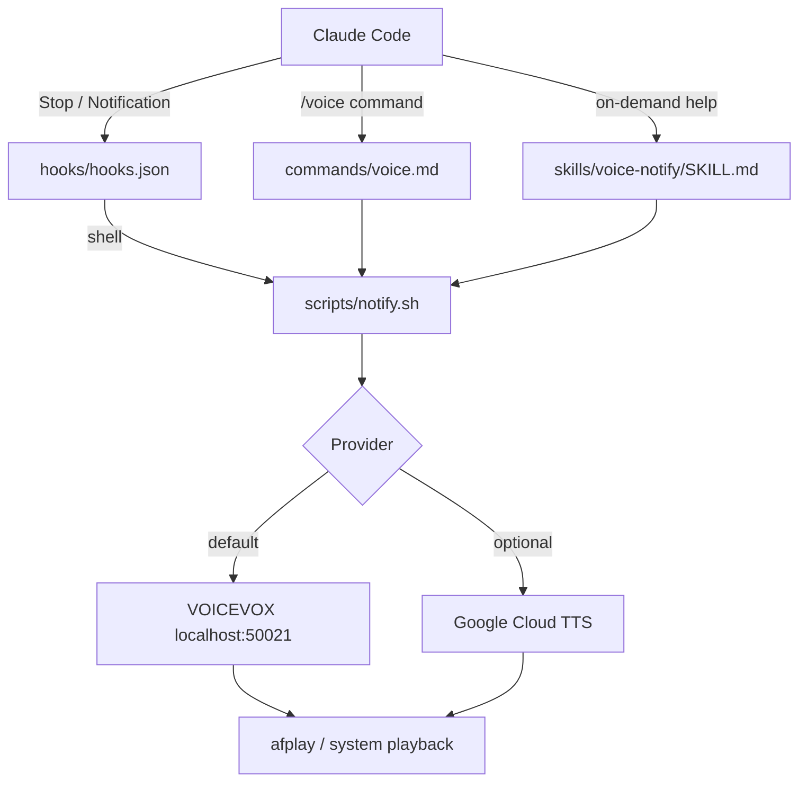

<div align="center">

<a href="./README.md"></a>
<a href="./README_ja.md"></a>

<br/><br/>


[](https://github.com/DenverCoder1/readme-typing-svg)

[](https://github.com/kubouchiyuya)
[](https://x.com/kubouchiyuya)
[](https://consulting-payment-tool.vercel.app)


</div>

---

## What This Does

This repository provides the plugin edition of voice notifications for Claude Code. It uses Claude Code Hooks so the automation runs without a standing MCP server and without consuming context tokens.

That makes it the lightest-weight option in the voice stack: local, fast, and ready to attach directly to a Claude Code workflow.

---

## ✨ Features

| Feature | Description |
|---|---|
| Zero context cost | Hooks-triggered notification with no always-on process |
| Local VOICEVOX | Free default engine on your machine |
| Optional cloud TTS | Switch providers with configuration only |
| `/voice` command | Manage voice behavior from inside Claude Code |
| VS Code support | Toggle voice behavior in the editor |
| Bash-first design | Simple shell workflow for automation |

---

## 🚀 Quick Start

### Star First

> This repo follows the same star-gated philosophy as the MCP version.

### Install

```bash
git clone https://github.com/kubouchiyuya/claude-voice-plugin.git \
  ~/.claude/plugins/voice-notify
```

### Enable

```json
{
  "enabledPlugins": {
    "voice-notify": true
  }
}
```

### Test

```bash
~/.claude/plugins/voice-notify/scripts/notify.sh "Plugin active"
```

---

## 🏗️ Architecture



---

## 🛠️ Tech Stack


---

## 👤 Author

<div align="center">

| | |
|---|---|
| **Yuya Kubouchi (MASA2 / MASA Sub)** | Beauty Salon Owner → AI Architect |
| Location | Osaka, Japan |
| System | AKATSUKI / Miyabi Society |
| Identity | AI × Beauty Industry × Non-Engineer |

*"I do not code first. I design the workflow and let AI execute it."*

</div>

---

<div align="center">

**If this plugin saved tokens, give it a star.**

</div>
