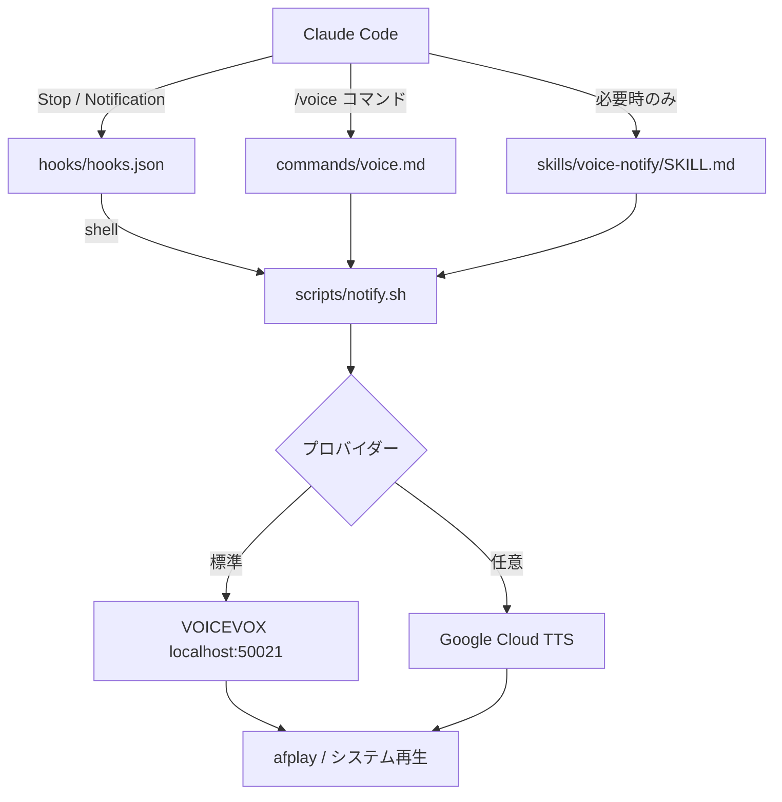

<div align="center">

<a href="./README.md"></a>
<a href="./README_ja.md"></a>

<br/><br/>


[](https://github.com/DenverCoder1/readme-typing-svg)

[](https://github.com/kubouchiyuya)
[](https://x.com/kubouchiyuya)
[](https://consulting-payment-tool.vercel.app)


</div>

---

## このツールでできること

このリポジトリは、Claude Code の音声通知を「プラグイン版」として提供します。MCP サーバーを常時起動しなくても、Hooks だけで完結するので、コンテキストを消費しません。

軽量で、ローカルで動き、Claude Code のワークフローへ直接差し込める構成です。

---

## ✨ 機能

| 機能 | 説明 |
|---|---|
| コンテキスト消費ゼロ | 常駐プロセス不要の Hooks 通知 |
| VOICEVOX 標準 | 無料でローカル動作 |
| クラウド TTS も可 | 設定変更だけで切り替え可能 |
| `/voice` コマンド | Claude Code から音声設定を操作 |
| VS Code 連携 | エディタ内で ON/OFF 切替 |
| Bash ベース | シンプルな自動化に向く |

---

## 🚀 はじめかた

### まずスターを押す

> MCP 版と同じく、スターを前提にした設計です。

### インストール

```bash
git clone https://github.com/kubouchiyuya/claude-voice-plugin.git \
  ~/.claude/plugins/voice-notify
```

### 有効化

```json
{
  "enabledPlugins": {
    "voice-notify": true
  }
}
```

### テスト

```bash
~/.claude/plugins/voice-notify/scripts/notify.sh "プラグインが有効です"
```

---

## 🏗️ アーキテクチャ



---

## 🛠️ 技術スタック


---

## 👤 作者

<div align="center">

| | |
|---|---|
| **窪内裕也（MASA2 / MASA サブ）** | 美容室オーナー → AI アーキテクト |
| 拠点 | 大阪 |
| 所属 | AKATSUKI / Miyabi Society |
| アイデンティティ | AI × 美容業界 × 非エンジニア |

*"私はコードを書く前に、AI が動ける仕組みを設計します。"*

</div>

---

<div align="center">

**トークンを節約できたら、スターで応援してください。**

</div>
